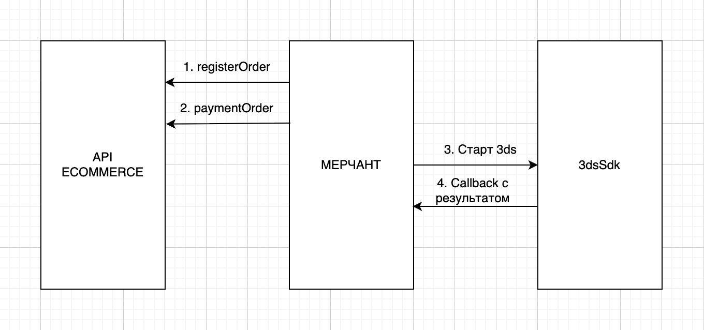

# [ThreedsSdkAndroidDoc](https://sdkpay.github.io/3dsSdkAndroidDoc/)

#### [Сценарии работы с SDK](https://sdkpay.github.io/3dsSdkAndroidDoc/sdk_scenario) | [Сущности и классы](https://sdkpay.github.io/3dsSdkAndroidDoc/sdk_classes) | [Актуальная версия SDK](https://sdkpay.github.io/3dsSdkAndroidDoc/sdk_version) | [Различия версий SDK](https://sdkpay.github.io/3dsSdkAndroidDoc/sdk_differences)

<br>

# Сценарии работы SDK

#### [Базовый сценарий](https://sdkpay.github.io/3dsSdkAndroidDoc/sdk_scenario#базовый-сценарий-для-sdk)

<br>

## Базовый сценарий для SDK

Включает в себя следующий флоу из методов:

1. [register.do](https://ecomtest.sberbank.ru/doc#tag/basicServices/operation/register) - Запрос предназначен для регистрации (создания) заказа в Шлюзе. При успешной обработке запроса заказу присваивается номер (идентификатор), уникальный в рамках Шлюза. Метод используется для регистрации заказа с последующией оплатой любым способом.
2. [paymentOrder.do](https://ecomtest.sberbank.ru/doc#tag/paymentServices/operation/paymentOrder) - Запрос предназначен для блокировки средств на карте Плательщика для проведения дальнейших расчетов между банками-участниками.
3. Запускается SDK. Приложение мерчанта ожидает успех/ошибку оплаты

##### Подробнее о пункте 3.

Вызываем Sdk3DS, стартуем launchSDK и передаём в config параметры: 
 - context (context из приложения мерчанта)
 - orderId (orderId из метода [register.do](https://ecomtest.sberbank.ru/doc#tag/basicServices/operation/register))
 - formUrl (formUrl из метода [paymentOrder.do](https://ecomtest.sberbank.ru/doc#tag/paymentServices/operation/paymentOrder))

После вызова SDK мерчанту в callback будут приходить статусы работы SDK

```kotlin
Sdk3DS.getInstance().launchSDK(
    config = ThreedsSdkMerchantOptionsConfig(
        context = context,
        orderId = orderId,
        formUrl = formUrl
    ) { result ->
        // Обработка result
    }
)
```

## Схема работы


